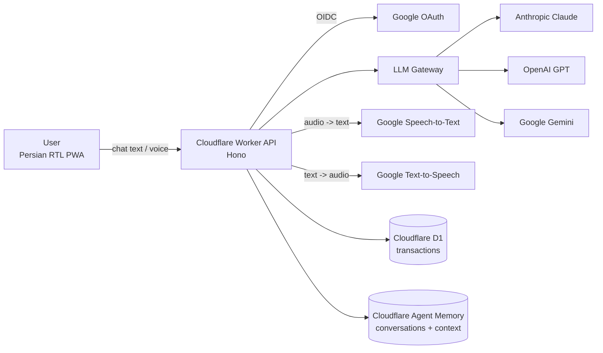

# Shila — Architecture

> Status: v1 draft (pre-code). Captures the decisions agreed for the first version plus the full vision with a phased roadmap. Open items are listed at the bottom.

## 1. Overview

Shila is a Persian-language personal assistant built on LLMs. It starts as a **personal accountant**: users describe their daily expenses (in chat or by voice), and Shila extracts structured financial records, stores them, and later helps manage costs, answer price questions, warn about bad purchases, and measure inflation.

The product is a ChatGPT-style, RTL, Persian chat UI deployed entirely on Cloudflare.

## 2. Guiding decisions (v1)

| Area | Decision |
| --- | --- |
| API runtime | Cloudflare Workers (TypeScript, Hono) |
| Frontend | React + Vite SPA, installable RTL Persian PWA (Cloudflare Pages) |
| LLM | Model-agnostic gateway with swappable adapters (Claude / GPT / Gemini) |
| Voice | Google Speech-to-Text + Text-to-Speech (Persian `fa-IR`) |
| Auth | Google OAuth / OIDC |
| Conversation & context storage | Cloudflare Agent Memory |
| Financial storage | Cloudflare D1 (SQLite) |
| v1 scope | Expense recording + voice input |

Deferred to later versions: image/receipt analysis, price lookup & Q&A, spending warnings, inflation measurement, bank-SMS reconciliation, in-app payments.

## 3. High-level diagram



## 4. Components

### 4.1 Web client (`apps/web`)
- React SPA, RTL Persian, PWA (offline shell, installable).
- Chat surface (streaming messages), auth (Google sign-in), mic capture + audio upload, transaction list view.
- Talks to the Worker API over HTTPS; streaming responses via Server-Sent Events (SSE).

### 4.2 Worker API (`apps/worker`)
Single Cloudflare Worker exposing a Hono router:
- `POST /auth/*` — Google OAuth/OIDC callback, session issuance.
- `POST /chat` — streaming conversational endpoint (SSE).
- `GET/POST /transactions` — list/create financial transactions.
- `POST /voice/transcribe` — upload audio, receive Persian transcript.
- `POST /voice/synthesize` — text-to-speech (later).

Middleware: auth/session verification, rate limiting, request logging.

### 4.3 LLM gateway (`apps/worker/src/llm`)
A provider-agnostic interface so the underlying model is configurable via environment (`SHILA_MODEL_PROVIDER`), not hard-coded:

```ts
interface LLMProvider {
  chat(messages: Message[], opts?: ChatOptions): Promise<AssistantMessage>;
  streamChat(messages: Message[], opts?: ChatOptions): AsyncIterable<string>;
  extractJson<T>(prompt: string, schema: ZodSchema<T>): Promise<T>;
}
```

Adapters: `anthropic`, `openai`, `gemini`. A factory resolves the provider from config. Extraction of structured expense data always goes through `extractJson` with a validated Zod schema (see §7).

### 4.4 Voice pipeline
- Input: browser captures audio (MediaRecorder) → uploads WebM/Opus to Worker → Worker forwards to Google Speech-to-Text (`fa-IR`) → returns transcript → transcript feeds the same expense-extraction pipeline as text.
- Output (later): Google Text-to-Speech to read confirmations/warnings back.
- Real-time voice is a post-v1 goal; v1 uses request/response transcription.

### 4.5 Storage
- **Cloudflare D1** — source of truth for financial transactions (relational, per-user).
- **Cloudflare Agent Memory** — conversation history and contextual info (user preferences, frequent categories, counterparties). Not authoritative for financial records; transactions always live in D1.

## 5. Data model (D1, sketch)

```sql
users (
  id          TEXT PRIMARY KEY,
  google_sub  TEXT UNIQUE NOT NULL,
  name        TEXT,
  locale      TEXT DEFAULT 'fa',
  created_at  INTEGER NOT NULL
);

transactions (
  id            TEXT PRIMARY KEY,
  user_id       TEXT NOT NULL REFERENCES users(id),
  amount        INTEGER NOT NULL,      -- in Toman (smallest tracked unit)
  currency      TEXT NOT NULL,         -- 'IRT' (Toman); see open questions
  category      TEXT,                  -- e.g. grocery, transport, debt repayment
  counterparty  TEXT,                  -- e.g. 'Hassan'
  description   TEXT,
  source        TEXT NOT NULL,         -- 'text' | 'voice' | 'image'
  raw_text      TEXT,                  -- original message / transcript
  occurred_at   INTEGER,               -- when the expense happened
  created_at    INTEGER NOT NULL
);

CREATE INDEX idx_transactions_user_time ON transactions(user_id, occurred_at);
```

Amounts are stored as integers in Toman (1 KT = 1,000 Toman). Category taxonomy starts small and is expanded from extraction output; a separate `categories` table is added once categories become user-customizable.

## 6. Key flows

### 6.1 Auth
1. User clicks "Sign in with Google" → redirect to Google OIDC.
2. Google redirects to Worker `/auth/callback` with code.
3. Worker exchanges code for tokens, verifies ID token, upserts `users` row by `google_sub`.
4. Worker issues a session cookie/JWT; subsequent requests are authenticated via middleware.

### 6.2 Text expense recording
1. User sends Persian text: *"I paid 120 KT to Hassan"*.
2. Worker appends message to Agent Memory for context.
3. Worker calls `extractJson` on the gateway with the transaction schema (§7).
4. Schema validation passes → row inserted into D1 → Shila confirms in chat with the parsed amount/category; validation failure → Shila asks a clarifying question.

### 6.3 Voice expense recording
1. User sends a voice note.
2. Worker forwards audio to Google Speech-to-Text (`fa-IR`) → Persian transcript.
3. Transcript follows the same path as §6.2 (extract → validate → persist → confirm).

## 7. Extraction contract

The LLM must return JSON matching this schema (Zod, shared with the client for display):

```jsonc
{
  "amount": 120000,            // integer, Toman
  "currency": "IRT",
  "category": "debt repayment",
  "counterparty": "Hassan",
  "description": "paid 120 thousand toman to Hassan",
  "occurred_at": "2026-09-23T12:00:00Z"  // optional; default now
}
```

Rules for the extraction prompt:
- If amount, currency, or counterparty is missing/ambiguous → return a `clarification` request instead of guessing.
- Persian numerals/units must be normalized (`۱۲۰`, `KT`, `هزار تومان` → 120000 Toman).
- Never fabricate; leave fields null rather than inventing values.

## 8. Project layout (target)

```
shila/
├── apps/
│   ├── web/               # React + Vite PWA (RTL Persian chat UI)
│   │   └── src/{components,features,lib}
│   └── worker/            # Cloudflare Worker (Hono API)
│       ├── src/{routes,llm,services,db}
│       └── wrangler.toml
├── packages/
│   └── contracts/         # shared TS types + Zod schemas (transaction, chat)
├── package.json           # pnpm workspace
├── pnpm-workspace.yaml
├── AGENTS.md
└── ARCHITECTURE.md
```

## 9. Roadmap (post-v1)

1. **Image/receipt analysis** — vision-capable LLM extracts price + item from a photo.
2. **Price lookup & Q&A** — answer questions from the user's own transaction history.
3. **Spending warnings** — flag high expenses and "bad purchases" from gathered price data.
4. **Inflation measurement** — aggregate historical prices over time.
5. **Bank-SMS reconciliation** — read bank messages (needs a native/mobile client) to match payments.
6. **In-app payments** — execute payments within the app.
7. **Real-time voice** — continuous conversation instead of request/response.

## 10. Open questions / assumptions

- **Currency unit**: amounts stored as Toman. Confirm whether official Rial (IRR) should also be tracked (1 Toman = 10 Rial).
- **Agent Memory API**: finalize which Cloudflare surface (Agents SDK / Workers AI) provides conversation + context persistence.
- **SSE vs WebSocket**: v1 uses SSE for streaming; revisit if real-time voice is added.
- **Category taxonomy**: start flat and small; decide whether categories are global or per-user.
- **Auth session**: confirm session mechanism (cookie vs. JWT) and token refresh strategy.
